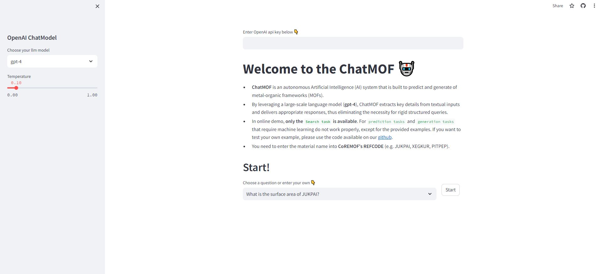

<center></center>


<p align="center">
  <a href="https://pypi.org/project/chatmof/">
     
 </a>
  <a href="https://figshare.com/articles/dataset/Database_for_ChatMOF/24287731">
     
 </a>
 <a href="https://doi.org/10.5281/zenodo.10806289">
     
 </a>
 <a href="https://pypi.org/project/chatmof/">
     
 </a>
</p>


# ChatMOF: an artificial intelligence system for predicting and generating metal-organic frameworks using large language models

ChatMOF is an artificial intelligence (AI) system that is built to predict and generate metal-organic frameworks (MOFs). By leveraging a large-scale language model (GPT-4, GPT-3.5-turbo, and GPT-3.5-turbo-16k), ChatMOF extracts key details from textual inputs and delivers appropriate responses, thus eliminating the necessity for rigid and formal structured queries. The system is comprised of three core components (i.e., an agent, a toolkit, and an evaluator) and it forms a robust pipeline that manages a variety of tasks, including data retrieval, property prediction, and structure generations. ChatMOF shows high accuracy rates of 96.9% for searching, 95.7% for predicting, and 87.5% for generating tasks with GPT-4. Additionally, it successfully creates materials with user-desired properties from natural language.

NOTE: ChatMOF has been updated to 0.2.0 and includes a new tool `unit converter`.

## Online Demo
You can test ChatMOF in [Online-Demo](https://chatmof-online.streamlit.app/) site. It requires an `OpenAI key` (For more information, visit the [OpenAI site](https://platform.openai.com/docs/introduction)). In online demo, only the Search task is available. For prediction tasks and generation tasks that require machine learning do not work properly, except for the provided examples.



## Install

### Dependencies

NOTE: This package is primarily tested on Linux. We strongly recommend using Linux for the installation.

```
python>=3.9
```

### Installation

```bash
$ pip install chatmof
```
If you have a dependency issues between `torch` and `moftransformer`, uninstall `torch` and `pytorch-lightning`, install `torch <2.0.0`, and reinstall.

For prediction and generation task, you have to setup modules.

```bash
$ chatmof setup
```

Add the following line to `.bashrc` for the openai api key.
```shell
# openai api key
export OPENAI_API_KEY="enter_your_api_key"
```

If you want to search the internet, you'll need to enter the `GOOGLE_API_KEY` and `GOOGLE_CSE_ID` into `.bashrc`.
```shell
# google api and cse_id
export GOOGLE_API_KEY="enter_your_api_key"
export GOOGLE_CSE_ID="enter_your_id"
```

For MOF generation, you need to install GRIDAY.

```bash
$ chatmof install-griday
```

## How to use ChatMOF
You can use it by running chatmof's `run` function.

```bash
$ chatmof run
```


You can adjust argument of Chatmof such as model and temperature.

```bash
$ chatmof run --model-name gpt-3.5-turbo --temperature 0.5
```

You can use `help` to see more options.

```bash
$ chatmof run --help
```


## Example of ChatMOF
### 1) Search task
<center></center>

### 2) prediction task
<center></center>

### 3) generation task
<center></center>

## Architecture

ChatMOF comprises three core components: an agent, toolkits, and an evaluator. Upon receiving a query from human, the agent formulates a plan and selects a suitable toolkit. Subsequently, the toolkit generates outputs following the proposed plan, and the evaluator makes these results into a final response. More details for ChatMOF structure are described at [structure.md](structure.md).

<center></center>


## Citation
if you want to cite ChatMOF, please refer to the following paper:
> ChatMOF: an artificial intelligence system for predicting and generating metal-organic frameworks using large language models, Nature Communications 15, 4705 (2024) [[link]](https://www.nature.com/articles/s41467-024-48998-4)

## Contributing 🙌

Contributions are welcome! If you have any suggestions or find any issues, please open an issue or a pull request.

## License 📄

This project is licensed under the MIT License. See the `LICENSE` file for more information.

